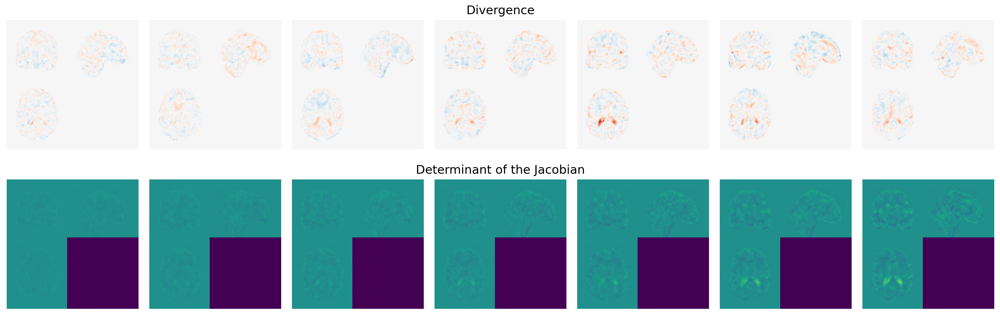

# MUSTER: Multi Session Temporal Registration
**MUSTER** is a tool designed for the registration of longitudinal 3D medical images. Built on PyTorch, MUSTER leverages GPU acceleration for fast and efficient processing. For instance, a timeseries of 8 images at a ``[160, 160, 160]`` resolution can typically be processed in just 2 minutes.



## Installation
Ensure that Python is installed on your machine. Then execute the following command to install **MUSTER**:

```bash
pip install pymuster
```
## Instructions
**MUSTER** can be used in two ways, either as a command line tool or as a Python package. See the full documentation on: https://crai-ous.github.io/MUSTER 

### Command Line Interface
TO BE IMPLEMENTED
After installing the package via pip, execute the following command to perform registration:
```bash
muster registration <in_dir> <out_dir>
```
Here ``<in_dir>`` refers to the directory path where your subject's data in BIDS format is stored. Each session should be in its own subfolder. Ensure that the session folders are named in a way that their alphabetical sorting aligns with the correct temporal order.

``<out_dir>`` is the directory where the output will be saved. Deformation data for each session relative to all other sessions will be stored in this directory.

### Python Package
For more flexibility and access to advanced settings, you can also use **MUSTER** as a Python package. Please refer to the in-code documentation for details on how to use it.
